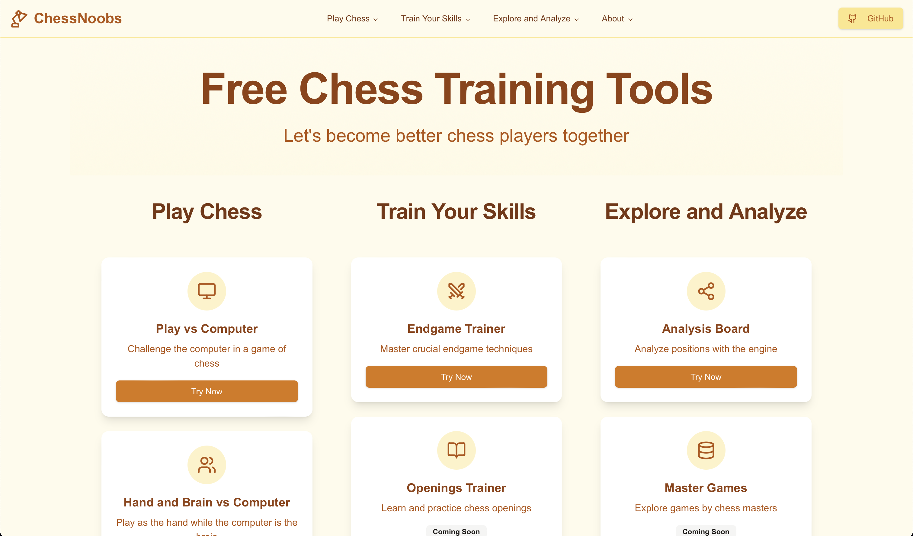

# ChessNoobs

Welcome to ChessNoobs, a web application designed to help you improve your chess skills through interactive features like endgame training, evaluation, and more.

## Features

- **Endgame Trainer**: Practice various endgame scenarios categorized by difficulty levels. Each puzzle is designed to enhance your strategic thinking and endgame skills.
- **Evaluation Bar**: Visualize the evaluation of the current board position, helping you understand the strength of your position.
- **Hints and Best Moves**: Get hints and see the best moves suggested by the engine to improve your gameplay.
- **Undo and Reset**: Easily undo moves or reset the board to the starting position to try different strategies.

## Development

To contribute to ChessNoobs, clone the repository and follow the setup instructions in the `CONTRIBUTING.md` file. We welcome contributions from developers of all skill levels.

## License

ChessNoobs is open-source software licensed under the MIT License. See the `LICENSE.md` file for more information.

## Contribute

If you want to contribute to ChessNoobs, visit our [GitHub repository](https://github.com/sad-pixel/chessnoobs) and check out the open issues or create a new one.

Happy Chess Playing!
